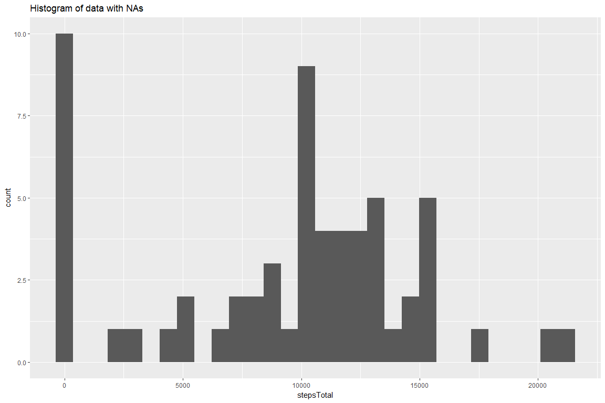
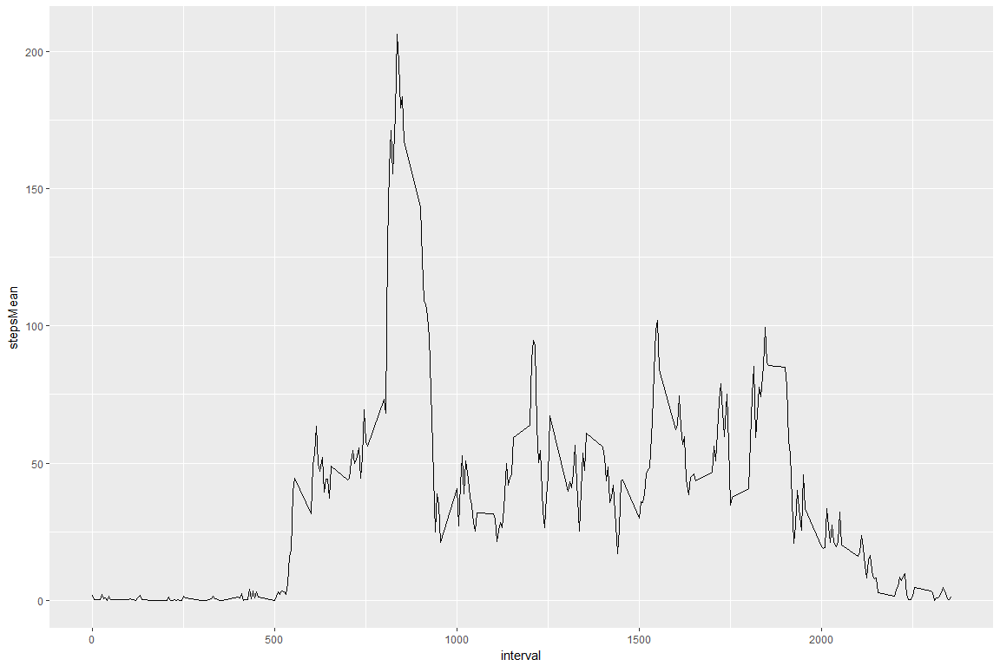
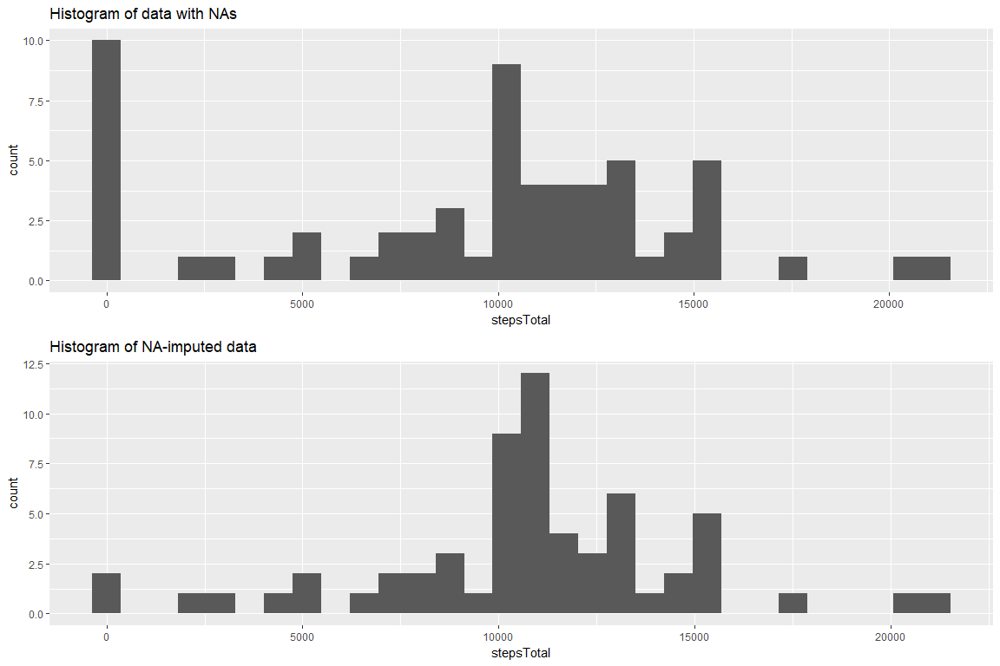
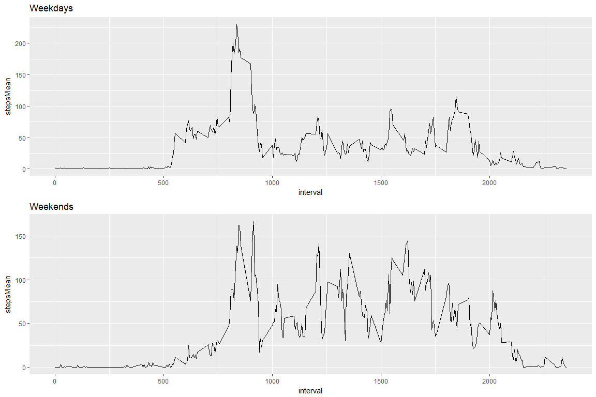

#Reproducible Research: Peer Assessment 1

===============================================================================

This R Markdown document performs and documents the analyses required for the Reproducible Research Peer Assessment 1.

#Set Global Options

```r
knitr::opts_chunk$set(fig.width=12, fig.height=8, fig.path='Figs/',
                      echo=TRUE, warning=FALSE, message=FALSE)
```

#Loading and preprocessing the data


```r
unzip("activity.zip")
data1 <- read.csv("activity.csv")
```

#What is mean total number of steps taken per day?

##Make a histogram of the total number of steps taken each day


```r
library(ggplot2)
library(plyr)
data2 <- ddply(data1, .(date), summarise, stepsTotal = sum(steps, na.rm = TRUE))
hist1 <- ggplot(data2, aes(x = stepsTotal)) + geom_histogram() + ggtitle("Histogram of data with NAs")
plot(hist1)
```

<!-- -->

##Calculate and report the mean and median total number of steps taken per day


```r
result1 <- summary(data2$stepsTotal)
c(result1[3], result1[4])
```

```
##   Median     Mean 
## 10395.00  9354.23
```

#What is the average daily activity pattern?

##Make a time series plot of the 5-minute interval (x-axis) and the average number of steps taken, averaged across all days (y-axis)


```r
library(ggplot2)
library(plyr)
data3 <- ddply(data1, .(interval), summarise, stepsMean = mean(steps, na.rm = TRUE))
ts1 <- ggplot(data3, aes(x = interval, y = stepsMean)) + geom_line()
plot(ts1)
```

<!-- -->

##Which 5-minute interval, on average across all the days in the dataset, contains the maximum number of steps?


```r
rank <- rank(data3$stepsMean)
data3[rank==max(rank),]
```

```
##     interval stepsMean
## 104      835  206.1698
```
#Imputing missing values

##Calculate and report the total number of missing values in the dataset (i.e. the total number of rows with NAs)


```r
nrow(data1) - sum(complete.cases(data1))
```

```
## [1] 2304
```

##Create a new dataset that is equal to the original dataset but with the missing data filled in

The imputation strategy is to fill in NA values with the interval mean value calculated across days.


```r
data4 <- merge(data1, data3, "interval")
data4[is.na(data4$steps),2] <- data4[is.na(data4$steps),4]
```

##Make a histogram of the total number of steps taken each day


```r
library(gridExtra)
library(ggplot2)
library(plyr)
data5 <- ddply(data4, .(date), summarise, stepsTotal = sum(steps, na.rm = TRUE))
hist2 <- ggplot(data5, aes(x = stepsTotal)) + geom_histogram() + ggtitle("Histogram of NA-imputed data")
grid.arrange(hist1, hist2, ncol = 1)
```

<!-- -->

##Calculate and report the mean and median total number of steps taken per day

The following is for the data with NA values.


```r
c(result1[3], result1[4])
```

```
##   Median     Mean 
## 10395.00  9354.23
```

The following is for the NA-imputed data.


```r
result2 <- summary(data5$stepsTotal)
c(result2[3], result2[4])
```

```
##   Median     Mean 
## 10766.19 10766.19
```

The impact is that the mean and the median are now both higher and also equal to each other.

#Are there differences in activity patterns between weekdays and weekends?

##Create a new factor variable in the dataset with two levels:
##Weekday and Weekend, indicating whether a given date is a weekday or weekend day


```r
data4$weekday <- weekdays(as.POSIXlt(data4$date))
data4$dayType <- "weekday"
data4[data4$weekday %in% c("Saturday", "Sunday"), 6] <- "weekend"
data4$dayType <- as.factor(data4$dayType)
```

##Make a panel plot containing a time series plot (i.e. type = "l") of the 5-minute interval (x-axis) and the average number of steps taken, averaged across all weekday days or weekend days (y-axis)


```r
library(gridExtra)
library(ggplot2)
library(plyr)
data6 <- ddply(data4, .(dayType, interval), summarise, stepsMean = mean(steps, na.rm = TRUE))
ts2 <- ggplot(data6[data6$dayType == "weekday", ], aes(x = interval, y = stepsMean)) + geom_line() + ggtitle("Weekdays")
ts3 <- ggplot(data6[data6$dayType == "weekend", ], aes(x = interval, y = stepsMean)) + geom_line() + ggtitle("Weekends")
grid.arrange(ts2, ts3, ncol = 1)
```

<!-- -->
